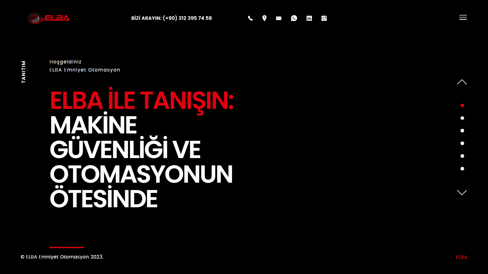
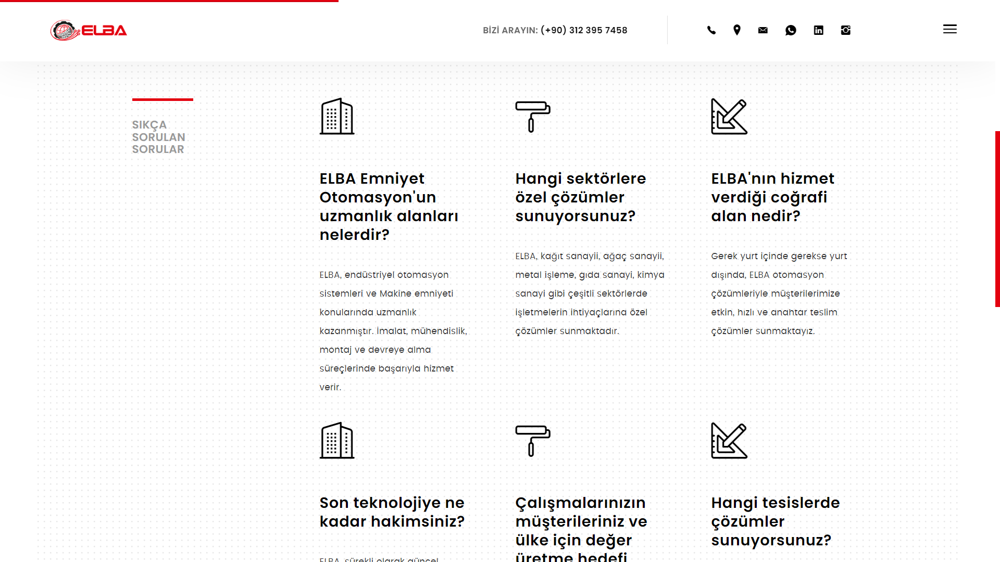

<h1 style="color:#e67e22;">🔧 Elba Otomasyon Web Sitesi</h1>

<strong style="color:#e74c3c;">Proje:</strong> Elba Otomasyon Web Sitesi

<strong style="color:#e74c3c;">Müşteri:</strong> Elba Otomasyon

<strong style="color:#e74c3c;">Kod Paylaşımı:</strong> Bu proje, müşteriye özel olduğu için kodlar paylaşılmamaktadır.

<h2 style="color:#2ecc71;">Proje Özeti</h2>

Bu proje, Elba Otomasyon için kapsamlı ve etkili bir web sitesi geliştirme üzerine odaklanmıştır. Web sitesi, firmanın otomasyon çözümlerini, ürünlerini ve hizmetlerini tanıtmak ve müşterilere dinamik bir kullanıcı deneyimi sunmak amacıyla tasarlanmıştır. Ayrıca, dinamik bir yönetim paneli ile desteklenmektedir.

<h2 style="color:#2ecc71;">Öne Çıkan Özellikler</h2>
<ul>
    <li><strong style="color:#f39c12;">Ürün ve Hizmet Tanıtımı:</strong> Elba Otomasyon’un sunduğu otomasyon ürünleri ve hizmetlerinin detaylı tanıtımı.</li>
    <li><strong style="color:#f39c12;">Dinamik Yönetim Paneli:</strong> Web sitesinin içeriğinin ve verilerinin dinamik olarak yönetilmesini sağlayan kapsamlı bir panel.</li>
    <li><strong style="color:#f39c12;">Kullanıcı Dostu Arayüz:</strong> Ziyaretçilerin kolayca bilgi bulabilmesi için etkili ve modern bir tasarım.</li>
    <li><strong style="color:#f39c12;">Duyarlı Tasarım:</strong> Mobil ve masaüstü cihazlarla uyumlu, esnek ve kullanıcı dostu bir yapı.</li>
    <li><strong style="color:#f39c12;">İletişim Formu:</strong> Kullanıcıların hızlı ve kolayca iletişime geçebileceği bir form.</li>
</ul>

<h2 style="color:#2ecc71;">Yönetim Paneli Özellikleri</h2>
<ul>
    <li><strong style="color:#f39c12;">Ürün Yönetimi:</strong> Ürün bilgileri eklenebilir, düzenlenebilir ve silinebilir.</li>
    <li><strong style="color:#f39c12;">Hizmet Yönetimi:</strong> Hizmetler hakkında detaylı bilgiler eklenebilir ve düzenlenebilir.</li>
    <li><strong style="color:#f39c12;">Kullanıcı Yönetimi:</strong> Yönetim paneline giriş yapabilen kullanıcıların yönetimi ve yetkilendirilmesi.</li>
    <li><strong style="color:#f39c12;">İçerik Güncellemeleri:</strong> Web sitesi içeriği dinamik olarak güncellenebilir.</li>
</ul>

<h2 style="color:#2ecc71;">Görseller</h2>

Web sitesinin bazı bölümlerine ait görseller aşağıda sunulmuştur:

<!-- Görsel 1 -->

<!-- Görsel 2 -->

<h2 style="color:#2ecc71;">Websitesi Linki</h2>

Projeyi canlı olarak görmek için <a href="https://www.elbaotomasyon.com.tr/" target="_blank" style="color:#2980b9; text-decoration: none;">buraya tıklayın</a>.

<h2 style="color:#2ecc71;">İletişim</h2>

Bu projeyle ilgili detaylar veya geri bildirim için <a href="mailto:treebsoftware@gmail.com" style="color:#c0392b; text-decoration: none;">buradan</a> bana ulaşabilirsiniz.

<em>Bu proje, Elba Otomasyon için özel olarak tasarlanmış ve müşteri ihtiyaçlarına uygun olarak geliştirilmiştir.</em>

